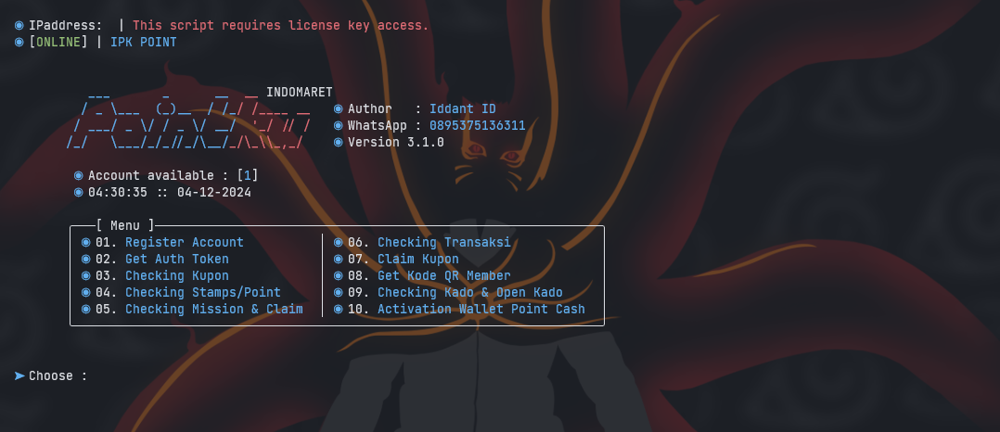

# INDOMARET POINTKU
POINTKU IDM

Fiture Tools POINTKU Version 3.1.0
- [x] Registrasi
- [x] Login & Get Auth Token
- [x] Checking Kupon
- [x] Checking Stamp/Point Loyalty/Point Cash
- [x] Checking Mission & Claim
- [x] Checking Transaksi
- [x] Claim Kupon or Reedem Kupon
- [x] Get Kode QR Member
- [x] Checking Kado & Open Kado
- [x] Activation Wallet Point Cash

Create and edit file ${{\color{red}device.txt}}$ for generate token
- [x] Format: NUMBER|PIN|DEVICE

Create and edit file ${{\color{red}account.txt}}$ access all fiture tools
- [x] Format: NUMBER|PIN|DEVICE|TOKEN

Contact admin for [Order Script](https://api.whatsapp.com/send?phone=62895375136311&text=Hai%2C%20Iddant%20ID%0AOrder%20script%20POINTKU%20V3.1.0%20dong.). 
Join telegram [Click Here](https://t.me/+Byl2O-KD_qswMTJl). 

# Note
The script runs with the license key,
if you don't have a license key then you can't run it,
to get a license key you have to ask the creator for its activation for a donation of course,
This script blocks multiple user logins so that the script remains safe and secure.

Regards,
**Iddant ID**
